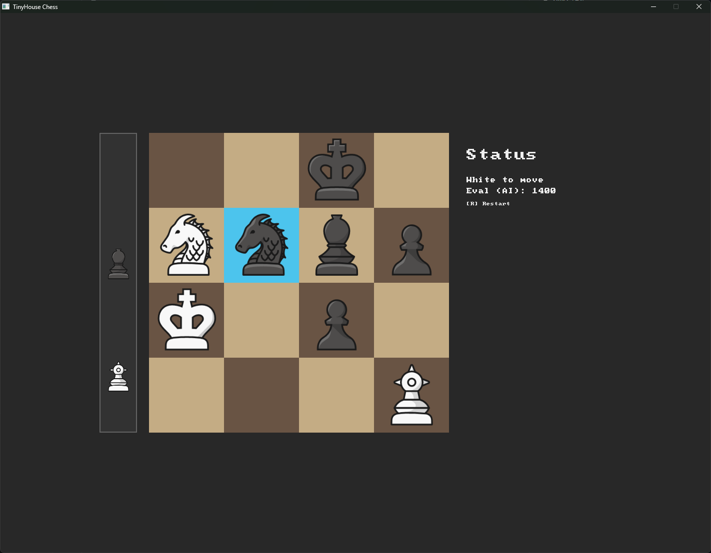

# Tiny House Chess game variant with AI
The initial goal of this project was to solve a small chess variant called **“tinyhouse”** on chess.com.  
It’s played on a 4×4 board, and the full rules can be found in [`TINYHOUSE_rules.txt`](./TINYHOUSE_rules.txt).


## Engine

When implementing the game engine, I took inspiration from the official Stockfish repository, mainly around position representation and board logic (see [`position.h`](./src/core/position.cc) / [`position.cc`](./src/core/position.h)).

For the AI, I went with a classic **negamax** search, implemented in [`minmax.cc`](./src/minmax/minmax.cc).  
At the moment there is:

- No parallel processing
- No advanced pruning beyond basic alpha–beta

Despite that, the engine already reaches solid search speeds on a single thread.

Current performance (depth is in **plies**, i.e. half-moves):

- **Depth 9 plies**  
  - Time: ~0.17–0.60 s  
  - Nodes: ~1.8M–6.4M  
  - Speed: **≈ 10–11 million nodes/s**

- **Depth 12 plies**  
  - Time: ~15–42 s  
  - Nodes: ~160M–420M  
  - Speed: **≈ 9.5–10.5 million nodes/s**

Across these tests, the node speed stays very stable (around **10M nodes per second**), and the effective branching factor at these depths comes out to roughly **4–4.5** moves per ply after alpha–beta pruning.


## UI

I built a simple game UI using **SDL3** where you can:

- Choose which side to play
- Watch the AI slowly corner you while the evaluation number climbs upward until the game ends

You can try it via:

```

ui_chess_game/build/tinychess.exe

```

## Player Automation

I also built an automation bot in Python.

Using basic machine learning, it is trained to:

- Recognize pieces on the board
- Detect which move was last played

The main script lives in:

```

player/main.py

```

## Results

Tests on chess.com show that the bot is able to beat essentially any human player, although the top players still manage to put up a good and entertaining fight.

## Running & Maintenance

I haven’t organized setup instructions or maintenance documentation yet.  
If this becomes necessary for others to run or contribute to the project, I’ll structure that part properly.

